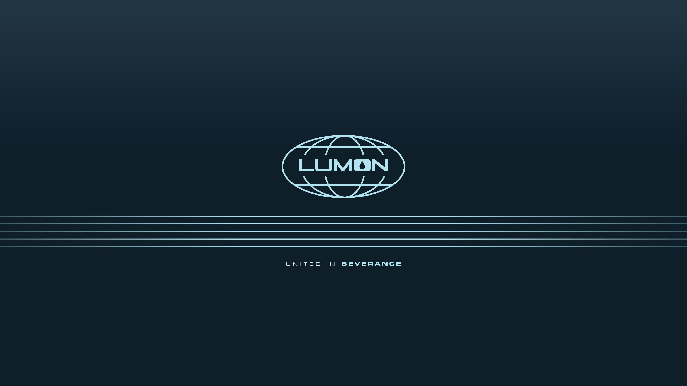
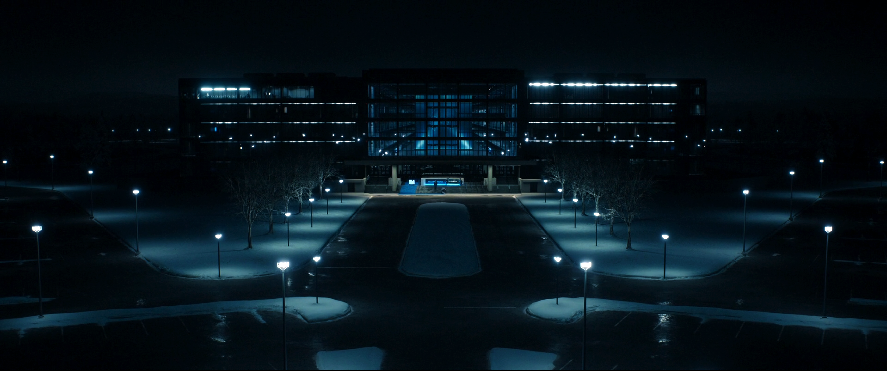

# Omarchy Lumon Theme

A cold corporate Omarchy theme inspired by Lumon Industries and the terminal palettes of *Severance*: navy voids, fluorescent cyan edges, sterile blue-gray surfaces, and enough institutional calm to make every workflow feel faintly supervised.

## Preview


## Install

Per approved Lumon onboarding procedure, install the theme from GitHub:

```bash
omarchy-theme-install https://github.com/OldJobobo/omarchy-lumon-theme
```

Upon successful installation, your workstation may begin exhibiting improved orderliness, emotional partitioning, and respect for clean geometric borders.

## Orientation

Welcome, refiner.

The Lumon Theme is designed to transform a standard Omarchy workstation into a compliant Macrodata Refinement environment. This package includes coordinated terminal palettes, desktop surfaces, lockscreen styling, notifications, and wallpaper assets aligned with approved Lumon visual doctrine.

Please enjoy each color equally.

## What's Included

- Hyprland presentation and border tuning (`hyprland.conf`)
- Hyprlock styling (`hyprlock.conf`)
- Terminal palettes for Alacritty, Kitty, Ghostty, Foot, and Warp
- UI surfaces for GTK, Walker, mako, and SwayOSD
- Supporting app themes for btop, Neovim, Vencord, and Aether/Zed
- The local Lumon launcher entry (`Lumon Macrodata Refiner.desktop`)
- Wallpaper set sourced for a unified Lumon workplace atmosphere

## Macrodata Refinement Access

For approved employees, the local launcher is:

`Lumon Macrodata Refiner.desktop`

Standard deployment path:

```text
~/.local/share/applications/Lumon Macrodata Refiner.desktop
```

This launcher opens the Lumon Macrodata Refiner web application through `omarchy-launch-webapp`, allowing refiners to begin their assigned duties in a properly sanctioned browser shell.

If your workstation has received the launcher, open your application launcher and search for:

`Lumon Macrodata Refiner`

Employees are advised not to speculate on the meaning of the numbers.

## Wallpapers

| | |
| --- | --- |
|  |  |

## Requirements

- A Hyprland-based Omarchy setup
- A terminal with support for theme import
- A healthy respect for fluorescent blue-white contrast
- Optional: the bundled `Lumon Macrodata Refiner.desktop` launcher for full workplace immersion

## Wellness Notes

- This README is written in-character and is not an official Lumon Industries publication.
- The theme itself is real.
- Your outie approved this installation.

## Attribution

- Inspired by the visual language of *Severance*
- Omarchy theme structure and install flow by the Omarchy ecosystem
